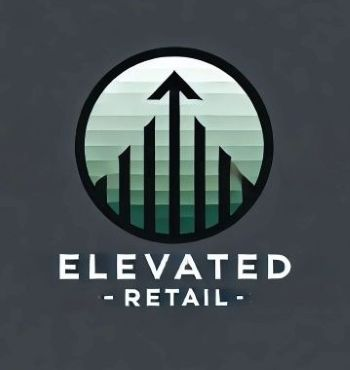

# elevate-retail
Forsyth Tech Class of '25 Capstone Project  

## Prerequisites

Before you begin, ensure you have the following installed on your local machine:

- [Git](https://git-scm.com/)
- [Python 3.8+](https://www.python.org/downloads/)  
- [Visual Studio Code (VS Code)](https://code.visualstudio.com/)
- [VS Code Python extension](https://marketplace.visualstudio.com/items?itemName=ms-python.python)
  - Can be installed through VS Code

If planning on using Dev Containers in VS Code:

- [Docker Desktop](https://www.docker.com/get-started/)
- [Dev Containers](https://code.visualstudio.com/docs/devcontainers/tutorial)
  - Can be installed through VS Code

An active GitHub account. You can also register as a student for access to the Pro features.

- [GitHub Signup](https://github.com/signup)

## Getting Started

To get started with this project please refer to the following guides:

- [Getting Started with Codespaces](./docs/getting_started_codespaces.md) :star:
- [Getting Started Locally](./docs/getting_started_locally.md) :computer:
- [VS Code Dev Container](./docs/getting_started_devcontainer.md) :whale:
- [Git Crashcourse](./docs/git-crashcourse.md) :globe_with_meridians:

## Running the app
  
Once you have everything installed and you want to actually see the app in a browser follow this guide:

- [Running The App](./docs/starting_the_app.md)
- [Working with SQL Server](./docs/sqlserver_guide.md)

# External Links

[Flask Documentation](https://flask.palletsprojects.com/en/stable/quickstart/)  
[Bootstrap Documentation](https://getbootstrap.com/docs/5.3/getting-started/introduction/)  
[Docker Documentation](https://docs.docker.com/)  
[Dev Containers Tutorial](https://code.visualstudio.com/docs/devcontainers/tutorial)  
[Codespaces Documentation](https://docs.github.com/en/codespaces)  
